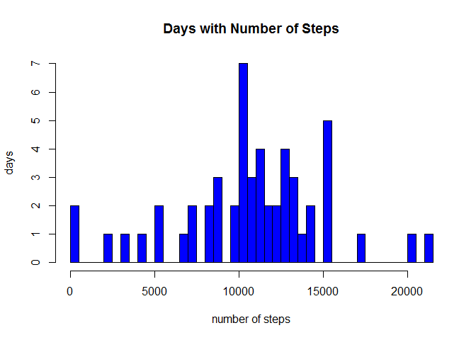
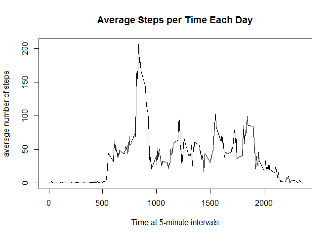
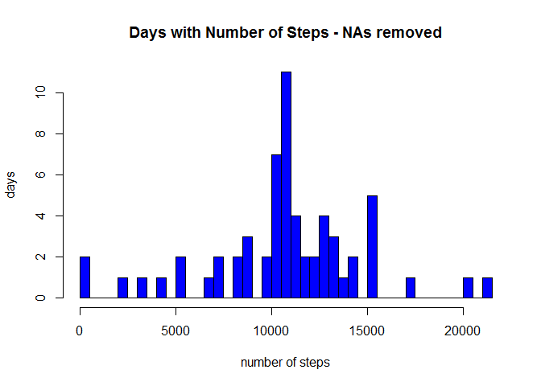
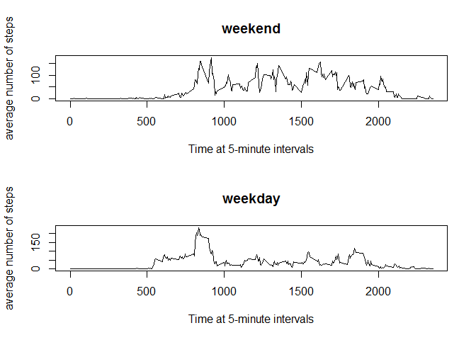

# Reproducible Research: Peer Assessment 1
William R. Moore  
March 6, 2016  


## Loading and preprocessing the data
Begin by adding required libraries and setting the working directory to the location of the activity.csv data file.


```r
library("dplyr")
```

```
## 
## Attaching package: 'dplyr'
```

```
## The following objects are masked from 'package:stats':
## 
##     filter, lag
```

```
## The following objects are masked from 'package:base':
## 
##     intersect, setdiff, setequal, union
```

```r
library("ggplot2")
library("lattice")

setwd("C:/Users/William R. Moore/Documents/GitHub/Reproducible Research/RepData_PeerAssessment1")
```
Next read the file into R.


```r
activity <- read.csv("activity.csv")
```


## What is mean total number of steps taken per day?

Make a histogram of the total number of steps taken each day.


```r
stepsPerDay <- activity %>% group_by(date) %>% summarise(totalSteps = sum(steps))
hist(stepsPerDay$totalSteps, breaks = 40, main = "Days with Number of Steps", xlab = "number of steps", ylab = "days", col = "Blue")
```



###Calculate and report the mean of the total number of steps taken per day

```r
mean(stepsPerDay$totalSteps, na.rm = TRUE)
```

```
## [1] 10766.19
```
###Calculate and report the median of the total number of steps taken per day

```r
median(stepsPerDay$totalSteps, na.rm = TRUE)
```

```
## [1] 10765
```


## What is the average daily activity pattern?
###Make a time series plot (i.e. type = "l") of the 5-minute interval (x-axis) and the average number of steps taken, averaged across all days (y-axis)

```r
activity$interval.factor <- as.factor(activity$interval)
activity_interval <- activity %>% group_by(interval.factor) %>% 
  summarise(mean.steps = mean(steps, na.rm =TRUE))
stepsInterval <- aggregate(steps ~ interval, data = activity, FUN = mean)
plot(stepsInterval, type = "l", 
     xlab = "Time at 5-minute intervals", 
     ylab = "average number of steps", main = "Average Steps per Time Each Day")
```



### Which 5-minute interval, on average across all the days in the dataset, contains the maximum number of steps?


```r
stepsInterval$interval[which.max(stepsInterval$steps)]
```

```
## [1] 835
```


## Imputing missing values
### Calculate and report the total number of missing values in the dataset (i.e. the total number of rows with NAs)


```r
sum(is.na(activity))
```

```
## [1] 2304
```
###Devise a strategy for filling in all of the missing values in the dataset. Create a new dataset that is equal to the original dataset but with the missing data filled in.

```r
activity2 <- merge(activity, stepsInterval, by = "interval", suffixes = c("",".y"))
nas <- is.na(activity2$steps)
activity2$steps[nas] <- activity2$steps.y[nas]
activity2 <- activity2[, c(1:3)]
```
###Make a histogram of the total number of steps taken each day and Calculate and report the mean and median total number of steps taken per day. Do these values differ from the estimates from the first part of the assignment? What is the impact of imputing missing data on the estimates of the total daily number of steps?

```r
stepsPerDate <- aggregate(steps ~ date, data = activity2, FUN = sum)
hist(stepsPerDate$steps, breaks = 40, main = "Days with Number of Steps - NAs removed", xlab = "number of steps", ylab = "days", col = "Blue")
```



```r
mean(stepsPerDate$steps)
```

```
## [1] 10766.19
```

```r
median(stepsPerDate$steps)
```

```
## [1] 10766.19
```
There is very little difference from the earlier values.
## Are there differences in activity patterns between weekdays and weekends?
###Create a new factor variable in the dataset with two levels - "weekday" and "weekend" indicating whether a given date is a weekday or weekend day.

```r
dType <- function(date) {
  if (weekdays(as.Date(date)) %in% c("Saturday", "Sunday")) {
    "weekend"
  } else {
    "weekday"
  }
}
activity$daytype <- as.factor(sapply(activity$date, dType))
```
###Make a panel plot containing a time series plot (i.e. type = "l") of the 5-minute interval (x-axis) and the average number of steps taken, averaged across all weekday days or weekend days (y-axis).

```r
par(mfrow = c(2, 1))
for (type in c("weekend", "weekday")) {
  stepsType <- aggregate(steps ~ interval, data = activity, subset = activity$daytype == 
                            type, FUN = mean)
  plot(stepsType, type = "l", main = type, xlab = "Time at 5-minute intervals", 
       ylab = "average number of steps")
}
```



